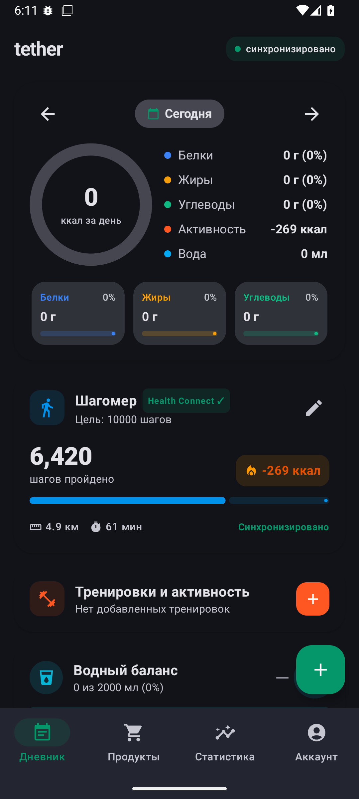
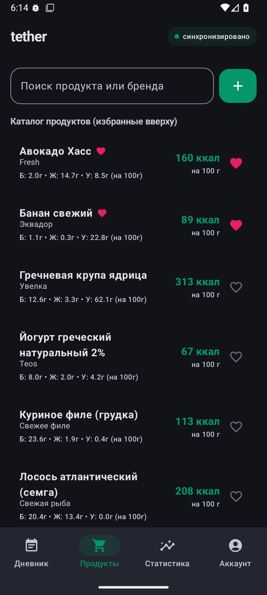
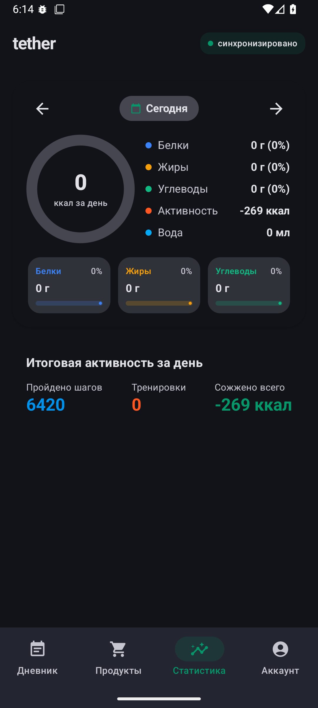
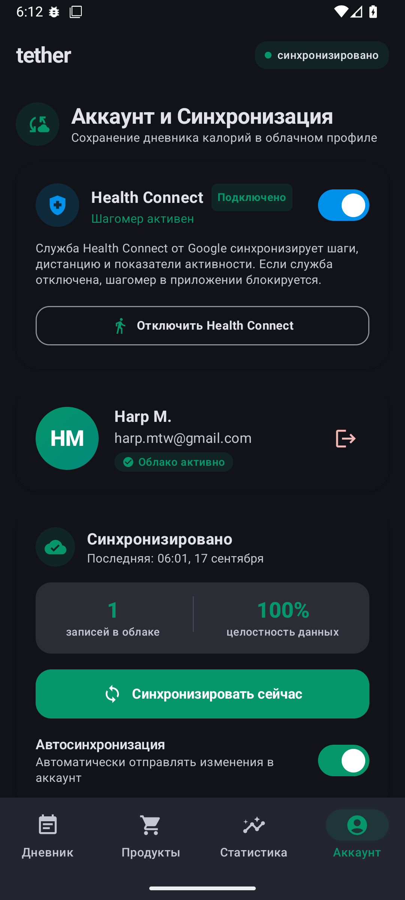

# tether
Android-приложение для ведения дневника питания, подсчёта калорий и макронутриентов с поддержкой сканирования штрих-кодов и синхронизации с аккаунтом.

_Приложение создано на базе **Kotlin** и **Jetpack Compose** с соблюдением стандартов Material Design 3._

| Экран дневника | Каталог продуктов |  Экран статистики  | Экран аккаунта |
| :---: | :---: |:-------------------------------------------------------------------------:| :---: |
|  |  |  |  |

